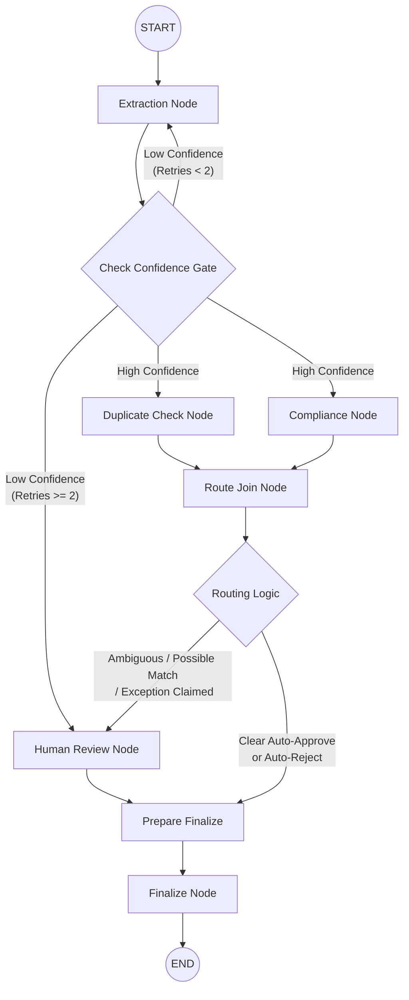

# Expense Approval Agent (Graph Workflow Demo)

A project demonstrating a graph-based agent architecture using LangGraph. It processes employee expense submissions to showcase parallel execution branches, a join node, a retry cycle, and a human-in-the-loop interrupt.

---

## What It Is & How It Works

When an expense (a receipt image and a short note) is submitted, the system runs a predefined workflow:

1. **Extraction**: A vision LLM reads the receipt image and extracts structured data (vendor, date, items, total, and alcohol presence).
2. **Confidence Gate**: If the LLM is unsure about the receipt's legibility, it loops back to retry extraction (capped at 2 retries before escalating).
3. **Parallel Analysis**: The data splits into two simultaneous tracks:
   - A plain Python script checks for duplicate submissions using exact metadata matching and perceptual image hashing.
   - An LLM call evaluates the expense against a sample corporate policy and a synthetic employee spending history CSV.
4. **Routing (Join)**: The graph waits for both parallel branches to finish, then applies a strict priority-ordered logic (e.g., exact duplicates or policy violations are auto-rejected, clean expenses are auto-approved).
5. **Human Review**: If the case is ambiguous, partially matches a duplicate, or claims a special exception, the system suspends execution using a checkpointer. A user can later review the state via a CLI script and resume the workflow.

---

## Graph Architecture

The architecture is built using LangGraph as a `StateGraph`.



### Node Breakdown
- **`extraction_node`**: Uses Gemini to read the receipt image and extract structured data using Pydantic.
- **`check_confidence_edge`**: Plain conditional logic that loops back to extraction if confidence is low.
- **`duplicate_check_node`**: A deterministic node (no LLM) that uses standard SQL queries and `imagehash` to find duplicates.
- **`compliance_node`**: A single LLM call that evaluates the extracted receipt against policy rules.
- **`route_join`**: The convergence point that waits for both parallel branches to finish and applies hierarchical conditional logic.
- **`human_review_node`**: A node where the LangGraph checkpointer is configured to suspend execution so a user can interject.
- **`finalize_node`**: Writes the final decision to a local SQLite database.

---

## Tools and Concepts Used

- **LangGraph**: Used to orchestrate the non-linear directed graph, allowing for branching logic, parallel execution, and loops.
- **Human-in-the-Loop Checkpointing**: Using `SqliteSaver`, the state of the graph is serialized to a local database when human input is required, allowing the process to pause and resume.
- **Structured Outputs**: Pydantic models paired with LangChain ensure the LLM returns typed JSON data.
- **Separation of Concerns**: Keeping deterministic tasks (like duplicate checking) separate from probabilistic LLM tasks to prevent hallucinations.

---

## Tech Stack

- **Python**
- **LangGraph & LangChain**
- **Google Gemini API (`gemini-3.8-flash`)**
- **SQLite**
- **Pydantic**
- **Pillow & Imagehash**

---

## Getting Started

### 1. Setup Environment
```bash
python -m venv venv
.\venv\Scripts\activate
pip install langchain langgraph langgraph-checkpoint-sqlite langchain-google-genai google-generativeai imagehash Pillow pydantic python-dotenv
```

### 2. Configure API Key
Create a `.env` file in the root directory and add your Gemini API Key:
```env
GEMINI_API_KEY="your_api_key_here"
```

### 3. Initialize the Database
Seed the SQLite database with the synthetic employee spending history and past receipts:
```bash
python data/seed_db.py
```

### 4. Run the Tests
Execute the main graph orchestrator, which processes the sample receipt images located in the `receipts/` directory:
```bash
python main.py
```

### 5. Resume Paused Graphs
If any expenses are flagged for escalation, the graph will pause. Run the review script to provide a final verdict:
```bash
python human_review.py
```